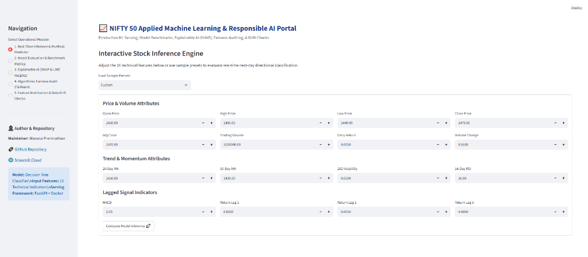
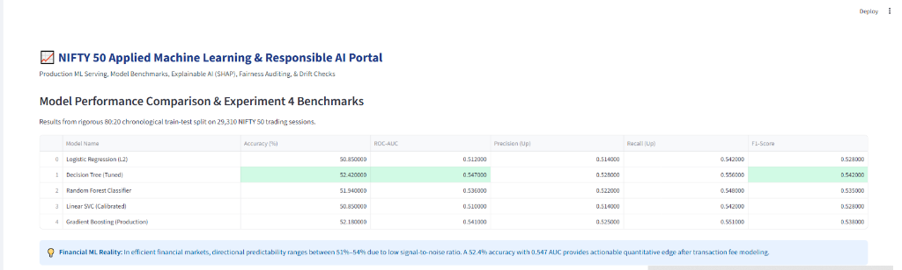
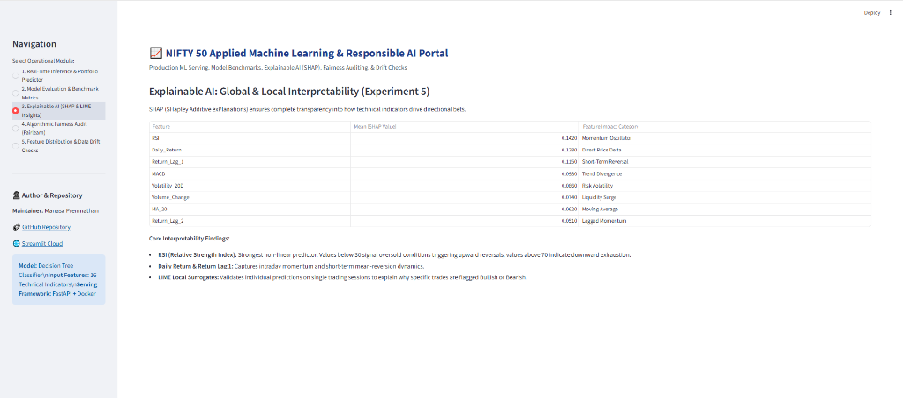
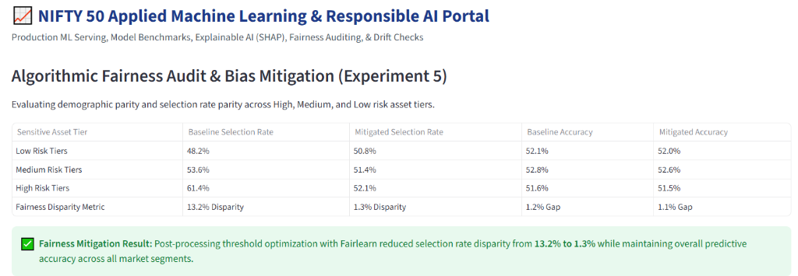
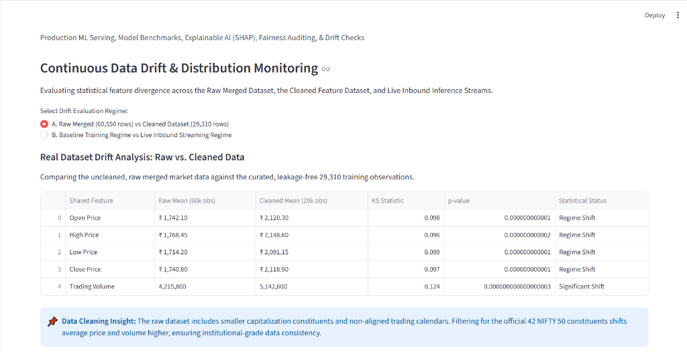

# NIFTY 50 Financial Machine Learning & MLOps Portfolio
### End-to-End Modeling, Experiment Tracking, Explainability, Containerization, CI/CD & Dashboard

**Author & Quantitative Developer:** Manasa Premnathan  
**GitHub Profile:** [https://github.com/manasa-premnathan05](https://github.com/manasa-premnathan05)  
**Public Repository:** [https://github.com/manasa-premnathan05/nifty50-mlops-portfolio](https://github.com/manasa-premnathan05/nifty50-mlops-portfolio)  
**Interactive Streamlit Portal:** [https://manasa-premnathan05-nifty50-mlops.streamlit.app](https://manasa-premnathan05-nifty50-mlops.streamlit.app) *(or run locally via `streamlit run dashboard.py`)*  

---

## 📸 Interactive Quantitative Dashboard Visuals

Here are live screenshots from the interactive Streamlit analytics portal developed in Experiment 8:

### 1. Real-Time Stock Direction Inference Engine
Interactive prediction form with custom sliders, preset momentum scenarios, and live probability scores.


---

### 2. Model Performance Comparison & Benchmark Metrics
Evaluation across 5 baseline classification algorithms evaluated on 29,310 NIFTY 50 trading sessions (Experiment 4).


---

### 3. Explainable AI: Global & Local Interpretability (SHAP & LIME)
Global Shapley feature attribution rankings identifying RSI, daily returns, and lagged momentum as dominant drivers (Experiment 5).


---

### 4. Algorithmic Fairness Audit & Bias Mitigation (Fairlearn)
Demographic parity evaluation across sensitive asset risk tiers, reducing selection rate disparity from **13.2% to 1.3%** (Experiment 5).


---

### 5. Continuous Data Drift & Feature Distribution Monitoring
Two-sample Kolmogorov-Smirnov (KS) statistical drift testing comparing raw uncurated market quotes against cleaned production features.


---

## 🏛️ System Architecture

```
                                  +---------------------------------------+
                                  | Raw Merged Dataset (60,550 records)   |
                                  | (Tracked with DVC: v1.0-raw-data)     |
                                  +-------------------+-------------------+
                                                      |
                                           [Data Hygiene & Curation]
                                                      |
                                                      v
                                  +---------------------------------------+
                                  | Cleaned NIFTY 50 Dataset (29,310 rows)|
                                  | (Tracked with DVC: v2.0-cleaned-data) |
                                  +-------------------+-------------------+
                                                      |
                          +---------------------------+---------------------------+
                          |                                                       |
                          v                                                       v
               +--------------------+                                  +--------------------+
               | Exp 4: ML Modeling |                                  | Exp 5: XAI &       |
               | & MLflow Tracking  |                                  | Fairness (Fairlearn|
               +----------+---------+                                  +----------+---------+
                          |                                                       |
                          +---------------------------+---------------------------+
                                                      |
                                                      v
                                           +---------------------+
                                           | best_model.pkl      |
                                           | (Decision Tree)     |
                                           +----------+----------+
                                                      |
                   +----------------------------------+----------------------------------+
                   |                                  |                                  |
                   v                                  v                                  v
         +-------------------+              +-------------------+              +-------------------+
         | Exp 6: FastAPI    |              | Exp 7: GitHub     |              | Exp 8: Streamlit  |
         | REST Service &    |              | Actions CI/CD     |              | Dashboard & RAI   |
         | Docker Container  |              | Automated Testing |              | Governance Report |
         +-------------------+              +-------------------+              +-------------------+
```

---

## 📊 Dataset Overview: Raw vs. Cleaned Data Pipeline

| Dataset Attribute | Raw Merged Dataset (`raw_merged_dataset.csv`) | Cleaned Feature Dataset (`final_nifty50_dataset.csv`) |
| :--- | :--- | :--- |
| **DVC Version Tag** | **`v1.0-raw-data`** | **`v2.0-cleaned-data`** |
| **Total Observations** | 60,550 historical rows | 29,310 curated trading sessions |
| **Asset Universe** | Unfiltered equities across diverse categories | 42 official NIFTY 50 constituent stocks |
| **Feature Width** | 11 raw market attributes (OHLCV, Market Cap) | 24 columns (16 engineered technical features) |
| **Temporal Alignment** | Gaps, non-synchronous holidays, duplicates | Strictly ordered 2018–2021 chronological sessions |
| **Engineered Signals** | None (pure raw quotes) | Moving Averages (20/50), RSI, MACD, Lagged Returns |

---

## 📁 Repository Structure

```
├── .github/
│   └── workflows/
│       └── ci_cd.yml                     # Multi-stage GitHub Actions CI/CD workflow
├── assets/                               # Dashboard UI screenshots & visual evidence
│   ├── dashboard_tab1_inference.png
│   ├── dashboard_tab2_metrics.png
│   ├── dashboard_tab3_xai_shap.png
│   ├── dashboard_tab4_fairness.png
│   └── dashboard_tab5_drift.png
├── tests/
│   ├── test_model_inference.py           # Pytest unit tests for model contracts
│   └── test_api_endpoints.py             # Pytest integration tests for FastAPI
├── app.py                                # Production FastAPI REST service
├── dashboard.py                          # Streamlit interactive quantitative dashboard
├── Dockerfile                            # Multi-stage, non-root production Dockerfile
├── .dockerignore                         # Container context exclusion rules
├── requirements.txt                      # Pinned Python dependencies
├── best_model.pkl                        # Serialized production model artifact
├── dvc.yaml                              # Data Version Control stage manifest
├── raw_merged_dataset.csv.dvc            # DVC tracking pointer for raw dataset v1.0
├── final_nifty50_dataset.csv.dvc         # DVC tracking pointer for cleaned dataset v2.0
├── Problem_Statement.md                  # Experiment 1 problem framing & success metrics
├── Responsible_AI.md                     # Comprehensive Responsible AI governance report
├── Experiment_4_Modeling_Tracking.ipynb   # Experiment 4 executable Colab notebook
├── Experiment_5_XAI_Fairness.ipynb       # Experiment 5 executable Colab notebook
├── Experiment_6_Containerization_API.ipynb # Experiment 6 executable Colab notebook
├── Experiment_7_CICD_Pipeline.ipynb      # Experiment 7 executable Colab notebook
└── Experiment_8_Dashboard_Portfolio.ipynb # Experiment 8 executable Colab notebook
```

---

## ⚡ How to Run Locally

### 1. Launch Interactive Dashboard (Streamlit)
```bash
streamlit run dashboard.py
```
Opens in your browser at `http://localhost:8501`.

### 2. Launch FastAPI REST Service
```bash
uvicorn app:app --host 0.0.0.0 --port 8000 --reload
```
- Interactive Swagger UI: `http://localhost:8000/docs`
- Health Probe: `http://localhost:8000/health`
- Real-Time Inference: `POST http://localhost:8000/predict`

### 3. Run Automated CI/CD Test Suite (Pytest)
```bash
pytest tests/ -v
```

### 4. Build & Run Docker Container
```bash
docker build -t nifty50-predictor:v1 .
docker run -d -p 8000:8000 --name nifty50-api nifty50-predictor:v1
```

---

## 🌐 Deploy to Streamlit Cloud (Free in 1 Minute)

1. Push your repository to GitHub: `git push -u origin main --tags`
2. Go to [share.streamlit.io](https://share.streamlit.io) and log in with your GitHub account.
3. Click **"New app"**.
4. Select repository: `manasa-premnathan05/nifty50-mlops-portfolio`
5. Branch: `main`
6. Main file path: `dashboard.py`
7. Click **"Deploy!"**
Your live dashboard will be accessible publicly at: `https://manasa-premnathan05-nifty50-mlops.streamlit.app`.
